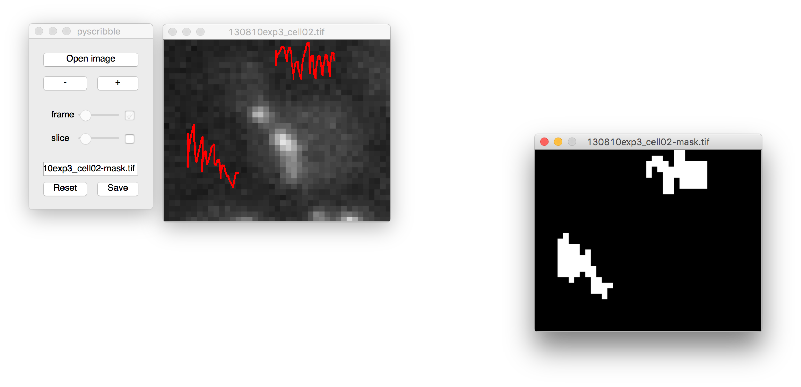

### Summary

Scribble pixels and save binary masks. The application currently supports only 4D images in .tif format (2D and 3D images are not tested).



### Usage

```
python path_to_pyscribble.py path_to_image_stack
```
